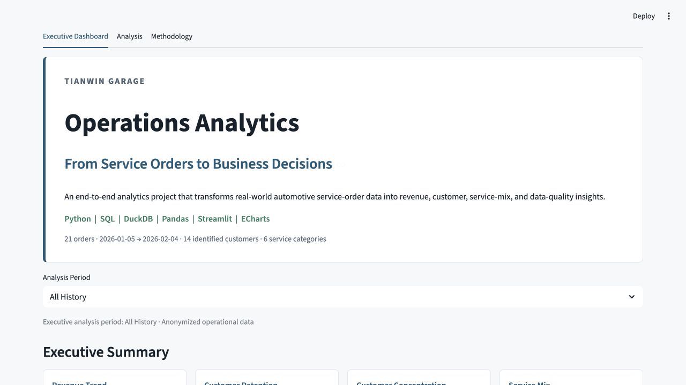
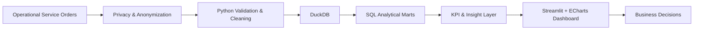
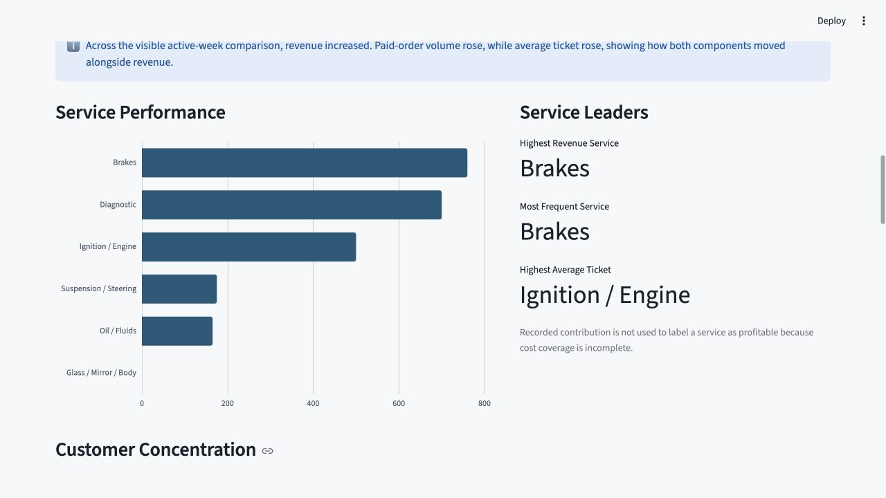
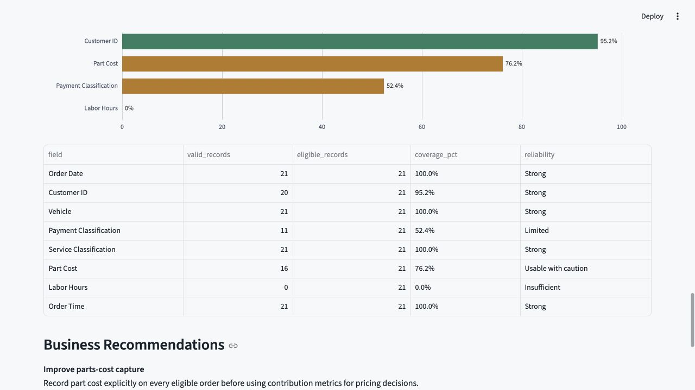

# Tianwin Garage Operations Analytics

> From Service Orders to Business Decisions

An end-to-end operational analytics project that transforms messy automotive service-order data into standardized KPIs, customer insights, service-performance analysis, data-quality metrics, and decision-ready business recommendations.

**Python | SQL | DuckDB | Pandas | Streamlit | ECharts**



## 1. Project Overview

Tianwin Garage Operations Analytics is a read-only, public-safe portfolio case study by **Frank Dong**. It follows the sequence from business question and reliable data to metric definition, analysis, implication, and action—not an order-management interface.

## 2. Business Problem

The business had service-order records but no standardized way to measure revenue performance, understand repeat customers, compare service categories, or assess whether the underlying data was reliable enough for decision-making.

## 3. Business Questions

The project evaluates revenue, order volume, average ticket, service mix, repeat-customer importance, customer concentration, payments, daily revenue, data reliability, excluded analyses, and priority owner actions.

## 4. Dataset

This portfolio uses **anonymized operational service records**. Personally identifiable information has been removed. Stable `CUST-NNN` IDs preserve repeat behavior; names, contact information, addresses, VINs, plates, notes, secrets, and private order IDs are excluded. Raw operational data is never committed.

Run `python scripts/build_public_dataset.py /private/path/orders.csv` locally to reproduce the privacy-safe CSV.

## 5. Data Challenges

The source contains inconsistent payment labels, free-text repairs, incomplete customers, sparse labor hours, partial part costs, and inconsistent vehicle text. Cleaning retains missingness instead of silently turning unknown costs into recorded zeroes.

## 6. Architecture



## 7. KPI Definitions

Centralized definitions cover Collected Revenue, Paid Orders, Average Ticket, Recorded Gross Contribution, Repeat Customers, repeat-customer revenue share, top-five customer share, and part-cost coverage. See the [KPI dictionary](docs/kpi_dictionary.md).

## 8. Analysis

The Executive Dashboard combines weekly revenue, ticket, and volume; ranks services; displays anonymous customer concentration; shows a revenue calendar and payment mix; and scores data reliability. The Analysis tab exposes privacy-safe aggregate tables.





Actual weekly mart logic:

```sql
SELECT date_trunc('week', order_date) AS week_start,
       count(*) FILTER (WHERE is_paid) AS paid_orders,
       sum(total_price) FILTER (WHERE is_paid) AS collected_revenue,
       avg(total_price) FILTER (WHERE is_paid) AS average_ticket
FROM orders
GROUP BY 1
ORDER BY 1;
```

## 9. Key Findings

Findings are calculated dynamically from the selected analysis period. The repository avoids freezing numerical claims that could become stale when the public dataset is rebuilt.

## 10. Business Recommendations

Transparent rules prioritize actions when retention, customer or service concentration, part-cost coverage, or labor-hour coverage crosses a documented threshold. Every recommendation includes supporting evidence.

## 11. Data Quality

Coverage is measured for order date, customer ID, vehicle, payment classification, service classification, part cost, labor hours, and order time. Reliability is Strong (≥90%), Usable with caution (70–89.9%), Limited (40–69.9%), or Insufficient (<40%).

## 12. Limitations

Recorded contribution is not net profit; labor, overhead, and part costs are incomplete; service classes are rule-based; customer KPIs exclude unidentified records; a small business sample is not industry-representative; and associations are not causal. See [limitations](docs/limitations.md).

## 13. Technical Stack

Python 3.11, Pandas, DuckDB, SQL, Streamlit, ECharts, Pytest, Ruff, and GitHub Actions. The Tianwin fork's `develop` head was verified at `a8f5577168f0eb3a82ba58f2e72bc59df220127f`. Because a direct source install at that commit omits the compiled frontend bundle, the deployable package is reproducibly pinned to the corresponding stable `streamlit-echarts==0.7.0` release rather than a floating branch.

## 14. Project Structure

`src/` separates cleaning, validation, SQL access, KPIs, insights, recommendations, charts, and UI. `sql/` contains six marts; `tests/` protects key definitions; `docs/` records the brief, dictionaries, methodology, and limitations.

## 15. Running Locally

```bash
python3.11 -m venv .venv
source .venv/bin/activate
pip install -r requirements.txt
streamlit run app.py
```

No Google account or credentials are required.

## 16. Tests

```bash
pytest
ruff check .
```

CI runs both on pushes and pull requests.

## 17. Future Development

- Labor productivity once labor-hour coverage exceeds 70%
- Vehicle segmentation after make/model normalization improves
- Customer cohort analysis as history grows
- Revenue forecasting after sufficient weekly observations accumulate
- Pricing analysis after cost capture becomes more complete

## Resume Summary

Built an end-to-end operational analytics platform for automotive service data using Python, SQL, DuckDB, Streamlit, and ECharts; designed KPI definitions, normalized messy transaction records, analyzed revenue, customer retention, service mix, and data quality, and translated findings into decision-ready business recommendations.

Additional documentation: [project brief](docs/project_brief.md) · [data dictionary](docs/data_dictionary.md) · [methodology](docs/methodology.md)
